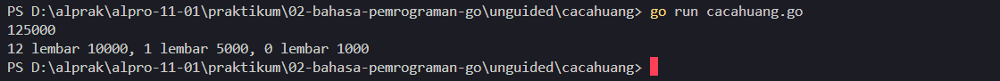
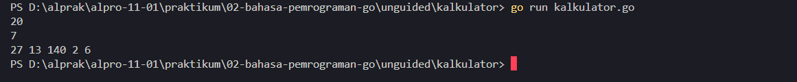

# <h1 align="center">Laporan Praktikum Modul 02 - Bahasa Pemrograman Go</h1>
<p align="center">Mirza Ukail Falah Triyarso - 109092600006</p>

## Dasar Teori

### A. Bahasa Pemrograman Go
Bahasa pemrograman Go, atau yang sering disebut sebagai Golang, adalah bahasa pemrograman sumber terbuka (open-source) yang dikembangkan oleh Google pada tahun 2007 oleh Robert Griesemer, Rob Pike, dan Ken Thompson, kemudian dirilis secara publik pada tahun 2009. Go dirancang untuk menciptakan perangkat lunak yang cepat, handal, dan efisien, khususnya dalam menghadapi tantangan skalabilitas perangkat keras modern seperti pemrosesan multi-inti (multi-core) dan sistem terdistribusi skala besar.

#### 1. Karakteristik Utama Bahasa Pemrograman Go
Menurut Donovan & Kernighan (2015), Go memiliki beberapa karakteristik mendasar yang membedakannya dari bahasa pemrograman lain:

<b> Statistika Tipe dan Kompilasi Cepat:</b> Go adalah bahasa yang dikompilasi (compiled language). Proses kompilasi kode sumber Go menjadi file biner berjalan sangat cepat, sehingga sangat mendukung produktivitas pengembang.

<b>Manajemen Memori Otomatis (Garbage Collection):</b> Go dilengkapi dengan fitur pengumpulan sampah memori otomatis untuk mengelola alokasi memori secara efisien tanpa membebani pemrogram secara manual.

<b>Dukungan Konkurensi Bawaan (Concurrency):</b> Salah satu keunggulan utama Go adalah dukungan konkurensi tingkat tinggi melalui penggunaan Goroutines (thread ringan yang dikelola oleh runtime Go) dan Channels (mekanisme komunikasi antar-goroutines). Hal ini membuat Go sangat unggul dalam menangani layanan web atau jaringan yang padat.

<b>Sintaks yang Sederhana dan Bersih:</b> Go memiliki filosofi desain yang mengutamakan keterbacaan kode (readability). Jumlah kata kunci (keywords) yang sedikit membuat bahasa ini relatif mudah dipelajari oleh pemula maupun pengembang berpengalaman dari latar belakang bahasa lain seperti C, C++, atau Java.

### ### B. Struktur Program di Go

Setiap program Go disimpan dalam file teks berekstensi `.go`. Program Go yang dapat dijalankan (executable) memiliki kerangka dasar yang terdiri dari deklarasi package, impor package lain, dan fungsi `main()`. Menurut Donovan & Kernighan (2015), aturan penulisan yang ketat ini membuat kode Go seragam dan mudah dibaca.

#### 1. Deklarasi `package main`
Baris pertama setiap file Go harus berupa deklarasi package. Package adalah cara Go mengelompokkan kode yang saling berkaitan. Untuk program yang ingin dijalankan langsung, nama package harus `main`.

```go
package main
```

Deklarasi ini memberi tahu compiler bahwa file tersebut akan dibuat menjadi program executable. Jika nama package selain `main`, file tersebut dianggap sebagai pustaka (library) yang dipakai oleh program lain, sehingga tidak dapat dijalankan sendiri.

#### 2. Impor Package dengan `import`
Kata kunci `import` dipakai untuk menggunakan fungsi dari package lain. Package yang paling sering dipakai pada praktikum awal adalah `fmt`, yang menyediakan fungsi untuk masukan (input) dan keluaran (output).

```go
import "fmt"
```

Jika ada lebih dari satu package, penulisannya dapat dikelompokkan dalam tanda kurung:

```go
import (
	"fmt"
	"math"
)
```

Go tidak mengizinkan package yang diimpor tetapi tidak digunakan. Kondisi ini akan menyebabkan error saat kompilasi.

#### 3. Fungsi `func main()`
`func main()` adalah titik awal eksekusi program. Ketika program dijalankan, Go akan mencari fungsi ini dan mengeksekusi instruksi di dalamnya secara berurutan dari atas ke bawah. Fungsi `main()` tidak memiliki parameter dan tidak mengembalikan nilai.

```go
func main() {
	// instruksi program ditulis di sini
}
```

Tanda kurung kurawal buka `{` harus berada pada baris yang sama dengan `func main()`. Menaruhnya di baris berikutnya akan menimbulkan error sintaks.

#### 4. Contoh Kerangka Program Lengkap
Gabungan ketiga komponen di atas membentuk program Go yang utuh:

```go
package main

import "fmt"

func main() {
	fmt.Println("Halo, Go!")
}
```

Pada contoh ini, `package main` menandai program executable, `import "fmt"` menyediakan fungsi cetak, dan `func main()` berisi perintah `fmt.Println` yang menampilkan teks ke layar.

#### 5. Koding, Kompilasi, dan Eksekusi
Proses membuat program Go melalui tiga tahap:

1. **Koding**: menulis kode sumber dengan text editor lalu menyimpannya dalam file `.go`.
2. **Kompilasi**: Go merupakan bahasa yang dikompilasi. Compiler memeriksa seluruh kode sumber, lalu menerjemahkannya menjadi file executable (berekstensi `.exe` pada Windows). Kompilasi dilakukan dengan perintah `go build`.
3. **Eksekusi**: file executable yang dihasilkan dijalankan melalui terminal. Selain itu, perintah `go run nama_file.go` dapat dipakai untuk mengompilasi sekaligus menjalankan program.

Beberapa perintah dasar pada utilitas Go:

| Perintah | Fungsi |
|---|---|
| `go build` | Mengompilasi program menjadi file executable |
| `go run nama_file.go` | Mengompilasi dan langsung menjalankan program |
| `go fmt` | Merapikan format kode sesuai standar Go |
| `go clean` | Menghapus file hasil kompilasi |


## Guided

### 1. skor.go

```go
package main

import "fmt"

func main() {
	var nama string
	var skorMatematika, skorBahasaInggris  int

	//membaca input
	fmt.Scan(&nama)
	fmt.Scan(&skorMatematika)
	fmt.Scan(&skorBahasaInggris)

	//menghitung total & rata-rata
	total := skorMatematika + skorBahasaInggris
	rataRata := total / 2
	//menampilkan output
	fmt.Println(nama)
	fmt.Println(total)
	fmt.Println(rataRata)
}
```
#### Deskripsi
`skor.go` adalah program Guided untuk menghitung total dan rata-rata skor seorang siswa dari dua mata pelajaran.

Pertama saya deklarasikan variabel `nama` bertipe `string`, lalu `skorMatematika` dan `skorBahasaInggris` bertipe `int`.
```go
var nama string
var skorMatematika, skorBahasaInggris int
```

Ketiganya diisi lewat input menggunakan `fmt.Scan`.
```go
fmt.Scan(&nama)
fmt.Scan(&skorMatematika)
fmt.Scan(&skorBahasaInggris)
```

Kedua skor dijumlahkan ke variabel `total`, lalu dibagi 2 untuk mendapat `rataRata`. Karena bertipe `int`, hasil bagi desimalnya dibuang. Misalnya total 175 menghasilkan rata-rata 87, bukan 87,5.
```go
total := skorMatematika + skorBahasaInggris
rataRata := total / 2
```

Hasilnya ditampilkan dengan `fmt.Println`: nama, total, lalu rata-rata.
```go
fmt.Println(nama)
fmt.Println(total)
fmt.Println(rataRata)
```

### 2. tukar.go

```go
package main

import "fmt"

func main() {
	var a, b int
	//membaca input
	fmt.Scan(&a)
	fmt.Scan(&b)

	//menukar nilai a dan b
	a, b = b, a
	//menampilkan output
	fmt.Println(a)
	fmt.Println(b)
}
```
#### Deskripsi
`tukar.go` adalah program Guided untuk menukar nilai dua variabel.

Saya deklarasikan variabel `a` dan `b` bertipe `int` karena nilainya bilangan bulat.
```go
var a, b int
```

Kedua nilai diisi lewat input menggunakan `fmt.Scan`.
```go
fmt.Scan(&a)
fmt.Scan(&b)
```

Penukaran dilakukan dengan `a, b = b, a`. Go mengizinkan penugasan ganda, jadi tidak perlu variabel bantuan. Misalnya input `3` dan `5` akan menghasilkan `a` bernilai 5 dan `b` bernilai 3.
```go
a, b = b, a
```

Hasilnya ditampilkan dengan `fmt.Println`, yaitu `a` lalu `b`.
```go
fmt.Println(a)
fmt.Println(b)
```

## Unguided

### 1. cacahuang.go

```go
package main

import "fmt"

func main() {
	var totalUang, sisaUang int
	var n10k, n5k, n1k int

	// Membaca input dari pengguna
	fmt.Scan(&totalUang)

	// Menghitung jumlah lembar menggunakan variabel sisa yang jelas
	n10k = totalUang / 10000
	sisaUang = totalUang % 10000

	n5k = sisaUang / 5000
	sisaUang = sisaUang % 5000

	n1k = sisaUang / 1000

	// Menampilkan hasil cetak dengan format satu baris (dipisah spasi)
	// Sesuai dengan format keluaran umum pada soal pemrograman dasar
	fmt.Printf("%d lembar 10000, %d lembar 5000, %d lembar 1000\n", n10k, n5k, n1k)
}
```

##### Output


#### Deskripsi
`cacahuang.go` adalah program Unguided untuk menghitung jumlah lembar uang pecahan 10000, 5000, dan 1000 dari sejumlah uang yang diinputkan.

Saya deklarasikan `totalUang` dan `sisaUang` untuk menyimpan uang, serta `n10k`, `n5k`, dan `n1k` untuk jumlah lembar tiap pecahan. Semuanya bertipe `int`.
```go
var totalUang, sisaUang int
var n10k, n5k, n1k int
```

Jumlah uang dibaca lewat `fmt.Scan`.
```go
fmt.Scan(&totalUang)
```

Perhitungan dimulai dari pecahan terbesar. Jumlah lembar didapat dari pembagian (`/`), sedangkan sisanya dihitung dengan modulo (`%`) lalu disimpan ke `sisaUang` untuk dihitung pada pecahan berikutnya. Misalnya untuk 27000, hasilnya 2 lembar 10000, 1 lembar 5000, dan 2 lembar 1000.
```go
n10k = totalUang / 10000
sisaUang = totalUang % 10000

n5k = sisaUang / 5000
sisaUang = sisaUang % 5000

n1k = sisaUang / 1000
```

Hasilnya ditampilkan dalam satu baris dengan `fmt.Printf`. `%d` diganti dengan nilai variabel sesuai urutannya.
```go
fmt.Printf("%d lembar 10000, %d lembar 5000, %d lembar 1000\n", n10k, n5k, n1k)
```

### 2. kalkulator.go

```go
package main

import "fmt"

func main() {
	var a, b int

	fmt.Scan(&a)
	fmt.Scan(&b)

	jumlah := a + b
	kurang := a - b
	kali := a * b
	bagi := a / b
	sisa := a % b

	fmt.Println(jumlah, kurang, kali, bagi, sisa)
}
```

##### Output


#### Deskripsi
`kalkulator.go` adalah program Unguided untuk menghitung hasil penjumlahan, pengurangan, perkalian, pembagian, dan sisa bagi dari dua bilangan bulat.

Saya deklarasikan `a` dan `b` bertipe `int`, lalu nilainya dibaca lewat `fmt.Scan`.
```go
var a, b int

fmt.Scan(&a)
fmt.Scan(&b)
```

Kelima operasi disimpan ke variabel masing-masing dengan bentuk singkat `:=`. Karena `a` dan `b` bertipe `int`, hasil `bagi` adalah pembagian bilangan bulat (desimalnya dibuang), dan `sisa` didapat dari operator modulo `%`. Misalnya untuk `a` = 17 dan `b` = 5, hasilnya 22, 12, 85, 3, dan 2.
```go
jumlah := a + b
kurang := a - b
kali := a * b
bagi := a / b
sisa := a % b
```

Hasilnya ditampilkan dalam satu baris dengan `fmt.Println`, dipisah spasi secara otomatis.
```go
fmt.Println(jumlah, kurang, kali, bagi, sisa)
```

## Kesimpulan
Dari praktikum Modul 02 ini, saya dapat menyimpulkan beberapa hal:

1. Program Go yang dapat dijalankan minimal terdiri dari `package main`, `import` untuk package yang dibutuhkan, dan `func main()` sebagai titik awal eksekusi.
2. Go adalah bahasa yang dikompilasi. Kode sumber disimpan dalam file `.go`, lalu dikompilasi dengan `go build` atau langsung dijalankan dengan `go run`.
3. Variabel dapat dideklarasikan dengan `var` atau bentuk singkat `:=`. Tipe data yang dipakai di praktikum ini adalah `int` dan `string`.
4. Input dibaca dengan `fmt.Scan` dan output ditampilkan dengan `fmt.Println` atau `fmt.Printf`.
5. Operator aritmatika (`+`, `-`, `*`, `/`, `%`) dipakai pada program `skor.go`, `cacahuang.go`, dan `kalkulator.go`. Pembagian pada tipe `int` menghasilkan bilangan bulat, sedangkan sisa bagi didapat dari operator `%`.
6. Penugasan ganda `a, b = b, a` pada `tukar.go` memungkinkan penukaran nilai tanpa variabel bantuan.

Semua program Guided dan Unguided berhasil dijalankan sesuai yang diharapkan.

## Referensi
1. Donovan, A. A. A., & Kernighan, B. W. (2015). *The Go Programming Language*. Boston: Addison-Wesley.
2. The Go Authors. (2024). *A Tour of Go*. Diakses pada 26 September 2026 melalui https://go.dev/tour/basics/1
3. The Go Authors. (2024). *Package fmt*. Diakses pada 27 September 2026 melalui https://pkg.go.dev/fmt
4. Materi Modul 02 - Pemrograman Bahasa Go. Skema dan Struktur Algoritma