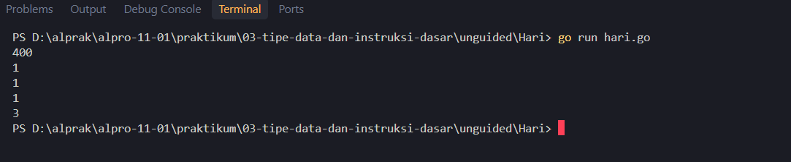

<h1 align="center">Laporan Praktikum Modul 03 - Variable dan Operator</h1>
<p align="center">Mirza Ukail Falah Triyarso - 109092600006</p>

## Dasar Teori

### A. Variable

Variabel adalah tempat penyimpanan data di memori. Isinya bisa dibaca dan diubah selama program berjalan.

#### 1. Deklarasi Variabel
Cara paling dasar adalah memakai kata kunci `var`, diikuti nama variabel dan tipe datanya:

```go
var name string
name = "Mirza Ukail"
```

Nilai juga bisa langsung diberikan saat deklarasi:

```go
var angka int = 10
```

Beberapa variabel bertipe sama bisa dideklarasikan sekaligus:

```go
var a, b, c int
```

#### 2. Deklarasi Singkat dengan `:=`
Dengan `:=`, kata kunci `var` dan tipe data tidak perlu ditulis karena Go menentukan tipe dari nilai yang diberikan.

```go
angka := 10
pesan := "Hallo"
```

Bentuk ini hanya dapat dipakai di dalam function, tidak bisa untuk variabel global.

#### 3. Mengakses Variabel
Variabel yang sudah dideklarasikan wajib digunakan, jika tidak program akan error saat dikompilasi.

```go
fmt.Println(angka)
fmt.Println(pesan)
```

### B. Operator

Operator adalah simbol untuk memproses satu atau lebih nilai atau variabel.

#### 1. Operator Aritmatika

| Operator | Fungsi |
|---|---|
| `+` | Penjumlahan |
| `-` | Pengurangan |
| `*` | Perkalian |
| `/` | Pembagian (pada integer hasilnya bilangan bulat) |
| `%` | Sisa bagi (modulo) |

```go
a := 10
b := 3

fmt.Println(a + b) // 13
fmt.Println(a - b) // 7
fmt.Println(a * b) // 30
fmt.Println(a / b) // 3
fmt.Println(a % b) // 1
```

Operator aritmatika dapat digabung dengan `=` agar lebih singkat, misalnya `a += b` sama dengan `a = a + b`.

#### 2. Operator Perbandingan
Hasilnya bertipe `bool` (`true` atau `false`).

| Operator | Arti |
|---|---|
| `==` | Sama dengan |
| `!=` | Tidak sama dengan |
| `<` | Lebih kecil dari |
| `>` | Lebih besar dari |
| `<=` | Lebih kecil atau sama dengan |
| `>=` | Lebih besar atau sama dengan |

```go
a := 10
b := 3

fmt.Println(a == b) // false
fmt.Println(a != b) // true
fmt.Println(a < b)  // false
fmt.Println(a > b)  // true
fmt.Println(a <= b) // false
fmt.Println(a >= b) // true
```

#### 3. Operator Logika
- `&&` (AND): `true` jika kedua kondisi `true`.
- `||` (OR): `true` jika minimal satu kondisi `true`.
- `!` (NOT): membalik nilai kondisi.

```go
fmt.Println(a > 5 && b < 5) // true
fmt.Println(a < 5 || b < 5) // true
fmt.Println(!(a > 5))       // false
```

#### 4. Operator Bitwise
Dipakai untuk memanipulasi bit pada bilangan bulat: `&` (AND), `|` (OR), `^` (XOR), `&^` (AND NOT), `<<` (geser kiri), dan `>>` (geser kanan).

```go
a := 6 // biner: 0110
b := 3 // biner: 0011

fmt.Println(a & b)  // 2  (0010)
fmt.Println(a | b)  // 7  (0111)
fmt.Println(a ^ b)  // 5  (0101)
fmt.Println(a &^ b) // 4  (0100)
fmt.Println(a << 1) // 12 (1100)
fmt.Println(a >> 1) // 3  (0011)
```

## Guided

### 1. kasir.go

```go
package main

import "fmt"

func main() {
	var x int
	fmt.Print("Masukkan nominal: ")
	fmt.Scan(&x)

	var sepuluhribu int = x / 10000
	x = x % 10000

	var limaribu int = x / 5000
	x = x % 5000

	var seribu int = x / 1000

	fmt.Println(sepuluhribu, "lembar")
	fmt.Println(limaribu, "lembar")
	fmt.Println(seribu, "lembar")
}
```

#### Deskripsi
Input: program meminta nominal lewat `fmt.Print`, lalu `fmt.Scan(&x`) menyimpannya di variabel `x`.

Lembar Rp10.000: `x / 10000` menghitung jumlah lembar penuh, lalu `x % 10000` menyimpan sisa nominal yang belum terpenuhi.

Lembar Rp5.000: dari sisa tadi, `x / 5000` menghitung jumlah lembar, lalu `x % 5000` menyimpan sisanya.

Lembar Rp1.000: dari sisa itu,` x / 1000` menghitung lembar terakhir.

Output: ketiga jumlah lembar dicetak per baris.

### 2. konversi.go

```go
package main

import "fmt"

func main() {
	var celsius float64;

	fmt.Print("Masukkan suhu: ")
	fmt.Scan(&celsius)

	fmt.Println(celsius + 273)

}
```

#### Deskripsi
Deklarasi: `var celsius float64` membuat variabel bertipe desimal untuk menyimpan suhu.

Input: `fmt.Print` menampilkan permintaan, lalu `fmt.Scan(&celsius)` membaca suhu yang dimasukkan pengguna.

Konversi: `celsius + 273` menghitung Kelvin dengan rumus K = °C + 273.

Output: hasilnya dicetak dengan `fmt.Println.`

### 3. tukar.go

```go
package main

import "fmt"

func main() {
	var x, y, z int

	fmt.Scan(&x, &y, &z)

	temp := x
	x = y
	y = z
	z = temp

	fmt.Println(x, y, z)
}
```

#### Deskripsi
Deklarasi: `var x, y, z int` membuat tiga variabel bertipe bilangan bulat.

Input: `fmt.Scan(&x, &y, &z)` membaca tiga nilai sekaligus, dipisahkan spasi atau baris baru.

Simpan sementara: `temp := x` menyimpan nilai `x` lebih dulu supaya tidak hilang saat `x` ditimpa.

Geser nilai:
`x = y` (x diisi nilai y)
`y = z` (y diisi nilai z)
`z = temp` (z diisi nilai x yang lama)

Output: ketiga nilai dicetak dalam satu baris.

## Unguided

### 1. Suhu

```go
package main

import "fmt"

func main() {
	var celsius, reamur float64

	fmt.Scan(&celsius)
	reamur = 4.0 / 5.0 * celsius
	fmt.Println(reamur)
}
```

##### Output


#### Deskripsi
Program ini mengonversi suhu dari Celsius ke Reamur.

Variabel `celsius` dan `reamur` bertipe `float64` agar dapat menampung bilangan desimal.

Nilai Celsius dibaca dengan `fmt.Scan(&celsius)`, lalu dihitung dengan rumus `reamur = 4/5 × celsius`.

Penulisan `4.0 / 5.0` dipakai agar pembagian menghasilkan desimal (0.8), bukan 0 seperti pada pembagian integer. 

Hasilnya dicetak dengan `fmt.Println`.

### 2. Hari

```go
package main

import "fmt"

func main() {
	var hari int

	fmt.Scan(&hari)

	tahun := hari / 360
	hari = hari % 360

	bulan := hari / 30
	hari = hari % 30

	minggu := hari / 7
	sisa := hari % 7

	fmt.Println(tahun)
	fmt.Println(bulan)
	fmt.Println(minggu)
	fmt.Println(sisa)
}
```

##### Output


#### Deskripsi
Program ini mengonversi total hari menjadi tahun, bulan, minggu, dan sisa hari, dengan asumsi 1 tahun = 360 hari dan 1 bulan = 30 hari.

- **Input:** `fmt.Scan(&hari)` membaca total hari dari pengguna.
- **Tahun:** `hari / 360` menghitung tahun penuh, lalu `hari % 360` menyimpan sisa harinya.
- **Bulan:** dari sisa tadi, `hari / 30` menghitung bulan penuh, dan `hari % 30` menyimpan sisanya.
- **Minggu:** dari sisa itu, `hari / 7` menghitung minggu penuh, dan `hari % 7` menjadi sisa hari terakhir.
- **Output:** keempat nilai (tahun, bulan, minggu, sisa hari) dicetak per baris.

Sebagai contoh, input `400` menghasilkan 1 tahun, 1 bulan, 1 minggu, dan 3 hari.

## Kesimpulan

Dari praktikum Modul 03 mengenai Variabel dan Operator, diperoleh beberapa kesimpulan sebagai berikut:

### 1. Variabel
Variabel adalah tempat menyimpan data yang isinya dapat dibaca maupun diubah selama program dijalankan. Di Go, variabel bisa dideklarasikan dengan dua cara. Cara pertama memakai kata kunci `var` disertai nama dan tipe data. Cara kedua memakai bentuk singkat `:=`, yang langsung mengisi nilai sekaligus membuat Go menentukan tipe datanya secara otomatis. Perlu diingat bahwa `:=` hanya dapat dipakai di dalam function.

### 2. Operator
Operator adalah simbol yang dipakai untuk memproses satu atau lebih nilai atau variabel. Pada praktikum ini dipelajari empat jenis operator:

* **Operator aritmatika**, untuk perhitungan matematika dasar seperti penjumlahan, pengurangan, perkalian, pembagian, dan sisa bagi.
* **Operator perbandingan**, untuk membandingkan dua nilai dengan hasil bertipe `bool`, yaitu `true` atau `false`.
* **Operator logika**, untuk menggabungkan atau membalik kondisi, dengan hasil `bool` sesuai tabel kebenarannya.
* **Operator bitwise**, untuk memanipulasi bit-bit pada bilangan bulat.

### 3. Penerapan pada Praktikum
Konsep tersebut diterapkan langsung pada soal unguided. Operator `/` dan `%` dipakai untuk memecah suatu nilai menjadi satuan bertingkat (misalnya konversi hari), sedangkan pemilihan tipe `float64` memastikan hasil perhitungan desimal seperti konversi suhu tetap akurat.

Melalui praktik langsung, materi menjadi lebih mudah dipahami karena konsep yang dipelajari bisa langsung dicoba dan dilihat hasilnya.

## Referensi
1. Jurnal Modul 3 di Asisten Pratikum- Variable dan Operator
2. Modul Minggu 2 lms - Skema dan Struktur Algoritma